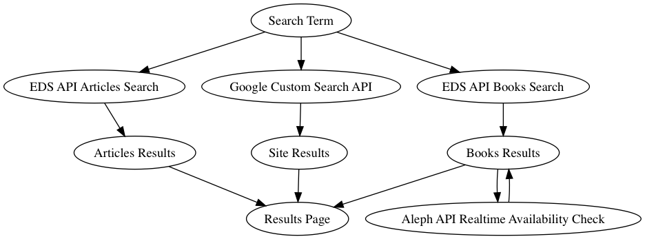

# MIT Bento

## What is this?

MIT Bento aims to search multiple data sources and return a summary of results
to aid a user towards a successful discovery experience.

It currently searches Ebsco Discovery Services API (EDS) and Google Custom
Search API. Appropriate credentials for both are required (see below).

## Bento System Overview

## Required Environment Variables

- `ALEPH_API_URI`: endpoint URI for Aleph Realtime Availability checks
- `ALEPH_KEY`: we use a custom API adapter to aleph that restricts via key
  instead of IP address
- `EDS_ARTICLE_FACETS`: facets to apply to create an articles search
  ex: &facetfilter=1,SourceType:Academic+Journals,SourceType:Magazines
- `EDS_BOOK_FACETS`: facets to apply to create a book search
  ex: &facetfilter=1,SourceType:Books,SourceType:eBooks,SourceType:Audiobooks
- `EDS_PASSWORD`: your EDS API password
- `EDS_PLINK_APPEND`: string to append to extracked PLink from EDS
- `EDS_PROFILE`: profile for your EDS API endpoint
- `EDS_PROFILE_URI`: URI for the EDS UI (not API) profile
- `EDS_URL`: the root EDS API URL
- `EDS_USER_ID`: your EDS API user id
- `FEEDBACK_MAIL_TO`: email address to send feedback messages
- `GOOGLE_API_KEY`: your Google Custom Search API key
- `GOOGLE_CUSTOM_SEARCH_ID`: your Google Custom Search engine ID
- `MAX_AUTHORS`: the maximum number of authors displayed in any record.
  If exceeded, 'et al' will be appended after this number.
- `RECAPTCHA_SITE_KEY`
- `RECAPTCHA_SECRET_KEY`
- `SMTP_ADDRESS`
- `SMTP_PASSWORD`
- `SMTP_PORT`
- `SMTP_USER`

## Optional Environment Variables

- `EDS_TIMEOUT`: value to override the 6 second default for EDS timeout
- `FLIPFLOP_KEY`: set this to enable access to the flipflop dashboard
- `LOG_LIKE_PROD`: uses prod-like logging in development if set
- `LOG_LEVEL`: set log level for development, default is `:debug`
- `RESULTS_PER_BOX`: defaults to 3
- `GLOBAL_ALERT`: html message to display as a global header
- `GOOGLE_ANALYTICS`: Google Analytics property ID
