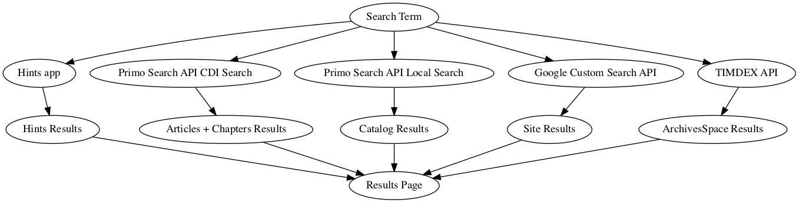

[](https://depfu.com/github/MITLibraries/bento)
[](https://codeclimate.com/github/MITLibraries/bento)

# MIT Bento

## What is this?

MIT Bento aims to search multiple data sources and return a summary of results
to aid a user towards a successful discovery experience.

It currently searches Ebsco Discovery Services API (EDS) and Google Custom
Search API. Appropriate credentials for both are required (see below).

## Bento System Overview



## Authentication Flow and Guest Mode Details

https://mitlibraries.atlassian.net/wiki/x/CoAeAw

## Loading Hints

Tasks exist to reload hints from supported sources.
Example to reload Aleph hints in a development environment:

```
heroku local:run bin/rails reloadhints:aleph
```

_note_: `reloadhints:aleph` requires ENV `ALEPH_HINT_SOURCE`

To reload custom hints in a development environment:

```
heroku local:run bin/rails reloadhints:custom[https://www.dropbox.com/blah/blah]
```

To reload custom hints in a heroku environment:

```
heroku run bin/rails reloadhints:custom['https://www.dropbox.com/blah/blah'] --app your-appname-staging
```

Depending on your shell, you may need single-quotes around the URL.

This expects to find a world-readable CSV file at the Dropbox location. Instructions for generating that file are in the Google sheet where we gather
custom hint metadata.

## Required Environment Variables

- `ALEPH_API_URI`: endpoint URI for Aleph Realtime Availability checks
- `ALEPH_UI_HOST`: hostname for Aleph UI. Defaults to production
- `ALEPH_KEY`: we use a custom API adapter to aleph that restricts via key
  instead of IP address
- `EDS_ARTICLE_FACETS`: facets to apply to create an articles search
  ex: &facetfilter=1,SourceType:Academic+Journals,SourceType:Magazines
- `EDS_BOOK_FACETS`: facets to apply to create a book search
  ex: &facetfilter=1,SourceType:Books,SourceType:eBooks,SourceType:Audiobooks
- `EDS_PASSWORD`: your EDS API password
- `EDS_PLINK_APPEND`: string to append to extracked PLink from EDS
- `EDS_PROFILE`: profile for your EDS API endpoint
- `EDS_PROFILE_URI`: URI for the EDS UI (not API) profile
- `EDS_URL`: the root EDS API URL
- `EDS_USER_ID`: your EDS API user id
- `EXL_INST_ID`: your Ex Libris institution ID.
- `GOOGLE_API_KEY`: your Google Custom Search API key
- `GOOGLE_CUSTOM_SEARCH_ID`: your Google Custom Search engine ID
- `MAX_AUTHORS`: the maximum number of authors displayed in any record.
  If exceeded, 'et al' will be appended after this number.
- `ALMA_SRU`: URL for Alma SRU query on alma.all_for_ui param. This is 
used to determine whether to redirect Bento full record links to Primo 
full records.
- `PRIMO_REDIRECTS`: toggles feature flag to enable Primo redirects for 
Bento full records.
- `PRIMO_SPLASH_PAGE`: URL for Libraries splash page explaining the 
transition from EDS to Primo.
- `PRIMO_SEARCH`: toggles feature flag to use Primo instead of EDS.
- `PRIMO_API_KEY`: the Primo API key.
- `PRIMO_API_URL`: the server URL for the Primo API.
- `PRIMO_VID`: our Primo 'view ID'.
- `PRIMO_TAB`: the value of the Primo `tab` param for Bento.
- `PRIMO_MAIN_VIEW_TAB` the value of the `tab` param for the Primo UI 
main search view. (This is used for links to Primo searches.)
- `PRIMO_BOOK_SCOPE`: assigned to the `scope` param of a Primo Search 
API endpoint to limit the search to local/Alma (Books+) results.
- `PRIMO_ARTICLE_SCOPE`: assigned to the `scope` param of a Primo Search 
API endpoint to limit  the search to CDI (Articles+) results.
- `MIT_PRIMO_URL`: the root URL for MIT Libraries' Primo instance.
- `SYNDETICS_PRIMO_URL`: the Syndetics API URL for Primo. This is used 
to construct thumbnail URLs.
- `RECAPTCHA_SITE_KEY`
- `RECAPTCHA_SECRET_KEY`
- `TIMDEX_URL`: The GraphQL endpoint for Timdex/ArchiveSpace
- `ASPACE_SEARCH_URI`: the base search URL for the Timdex/ArchiveSpace application

## Optional Environment Variables

- `ALEPH_HINT_SOURCE`: HTTP GET accessible marcxml source for Hints
- `ALEPH_HOLD_TYPE`: Switches between links to Aleph `item-hold-request` and
  `item-global`. Defaults to `item-hold-request`.
- `EDS_TIMEOUT`: value to override the 6 second default for EDS timeout
- `EDS_GEM_HOSTS_LIST`: override list of hosts to use for our full record views
  defaults to the (theoretically) load balanced EDS API endpoint. The protocol
  is not included, so use `example.com` instead of `https://example.com`
- `FLIPFLOP_KEY`: set this to enable access to the flipflop dashboard
- `GLOBAL_ALERT`: html message to display as a global header
- `HINT_SOURCES`: Comma-separated Hint source names, in descending order of priority. (If unset, will default to `custom`).
- `JS_EXCEPTION_LOGGER_KEY`: Enables and logs JavaScript errors.
  - Hints will only be displayed to the user if they are in `HINT_SOURCES`.
- `LOG_LIKE_PROD`: uses prod-like logging in development if set
- `LOG_LEVEL`: set log level for development, default is `:debug`
- `RESULTS_PER_BOX`: defaults to 3
- `SENTRY_DSN`: logs exceptions to Sentry
- `SFX_HOST`: URL to SFX Host. Defaults to production
- `SFX_ALEPH_HOST`: domain (not full URL) of Aleph server SFX uses to do MARC
  lookups. Defaults to production.
- `DISABLE_SCANS`: if set will disable scans for local aleph items
- `DISABLE_HOLDS`: if set will disable holds for local aleph items
- `DISABLE_ILLS`: if set will disable ILLs for local aleph items
- `DISABLE_RECALLS`: if set will disable recalls for local aleph items
- `DISABLE_REQUEST_DIGITAL`: if set will disable request digital copy button
- `REQUESTS_PER_PERIOD`: number of requests per time period we allow from a
  single non-MIT IP address. Defaults to 100. Example: "100".
- `REQUEST_PERIOD`: sets time period for number of requests per time period in
  minutes. Defaults to 1 minute. Example: "1". NOTE: for throttles to work in
  development make sure to [enable the dev cache](https://guides.rubyonrails.org/caching_with_rails.html#caching-in-development)

## Developing locally with Docker

A Dockerfile is provided that is intended solely for development work as it is
not optimized for production environments (and in fact doesn't install
production required dependencies so for real don't use it for anything else).

To build the container:

`docker build -t bento .`

To run the application while actively developing:

`docker run -it -p 3000:3000 --mount type=bind,source=$(pwd),target=/bento bento`
should mount your local copy of the code in a way in which
your changes are immediately reflected in the running app.

To run the tests it seems useful to mount your local code into a bash shell to
pick up changes live:

`docker run -it --mount type=bind,source=$(pwd),target=/bento --entrypoint /bin/bash bento`

Once in the containers shell:

`bundle exec rails test` should do the trick

If you just leave those running, you should see changes you make locally
reflected immediately in the running container.

`docker-compose` will load your `.env` file automatically for your config and
we use `/config/environment/test.rb` for test env stuff.
